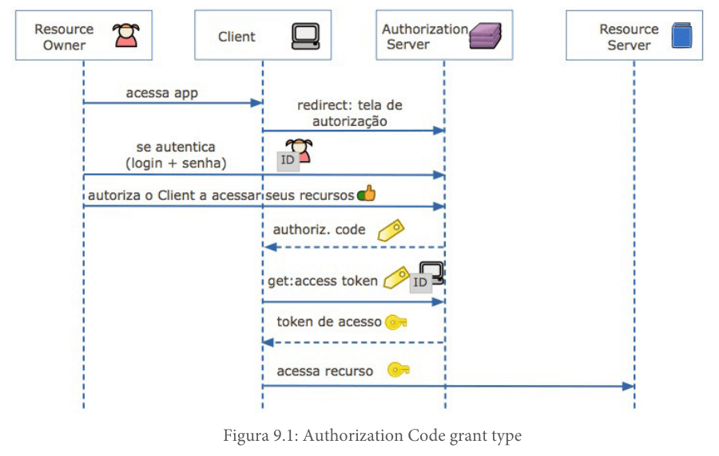

# Curso: Master Spring Boot Microservices with CQRS and Event Sourcing

## CQRS (Command Query Responsibility Segregation)

- **Definição:** Separação de responsabilidades entre leitura (Query) e escrita (Command) em uma aplicação.
- Exemplo: Ter uma camada de comandos para operações de escrita (e.g., salvar) e uma camada de consultas para operações de leitura (e.g., listar).

#### Comandos, Queries e Eventos

- **Command:** Ordem de mudança no sistema, geralmente no formato de um verbo no imperativo (e.g., salvar, criar).
  
- **Query:** Solicitação de um estado específico do objeto, operação de leitura.

- **Evento:** Objeto que descreve algo que já aconteceu, geralmente no formato de um verbo no passado (e.g., criado, atualizado).

#### Comandos do **user.cmd.api** e Eventos do **user.core** (Biblioteca de Classes)
- Todo comando resulta em um evento, os eventos ficam no user.core e são criados através do user.cmd.api pacote commands e pelos 3 comandos, Register, Update e Remove, portanto comandos do user.cmd.api e eventos do user.core estão fortemente relacionados, na verdade eles possuem a mesma aparência, a única diferença é que nos comandos tem a anotação do Axon @TargetAggregateIdentifier. Vale notar que a user.query.api não produz nenhum comando, portanto não produz nenhum evento, ela apenas consome eventos e dados do banco de leitura.


## Event Sourcing

- **Definição:** Utiliza um banco de eventos para armazenar o ciclo de vida de um objeto. Os eventos (create, update, delete) são armazenados e nunca apagados, proporcionando um histórico completo das mudanças em um objeto.

## CQRS sem Event Sourcing

- Possibilidade de utilizar CQRS sem armazenamento de eventos, mantendo apenas o estado atual do sistema.

## Event Sourcing sem CQRS

- Utilização de Event Sourcing sem separação de responsabilidades entre leitura e escrita.
- 
## Microserviços

- **Definição:** Arquitetura que visa a independência e falha isolada de serviços. Cada microserviço opera de forma independente, sem depender de outros serviços. A comunicação ocorre através de um barramento de eventos (Event Bus), permitindo operações assíncronas e resilientes.
- Um microserviço deve considerar que "tudo falha o tempo todo" e deve falhar de forma independente.
- A comunicação entre microserviços ocorre através de um barramento de eventos (Event Bus).
- Os eventos são publicados por um microserviço e consumidos por outros, garantindo que as operações sejam realizadas de forma assíncrona e resiliente.
- O barramento de eventos permite que os eventos sejam persistidos mesmo se um consumidor falhar, garantindo a consistência quando o consumidor é reiniciado.


## Spring Cloud Gateway

- **Definição:** Biblioteca do Spring que permite transformar o projeto Spring em um gateway reverso, facilitando o roteamento e filtragem de solicitações.

- **Configuração:** Destaca a simplicidade de configuração usando um arquivo de declaração de propriedades YAML para roteamento.

Se houver alguma parte específica que você gostaria de discutir ou se tiver mais perguntas, sinta-se à vontade para perguntar!

É uma biblioteca do spring que permite transformar o projeto spring em um gateway reverso, gateway é um ponto de acesso unificado, no nosso roteado temos um gateway que é o ponto entre nosso pc e a internet e ele pode ser usado para filtras sites perigosos, o gateway reverso é um gateway do lado do servidor onde também pode ser usado para filtrar ip suspeitos, terminação ssl e balanceamento de carga, o gateway fica no meio entre o client e o servidor de recursos.
Pra configurar, muito simples, cria um arquivo de declaração de propriedades yml, com propriedade route e 3 componentes principais, id - identificador, uri - rota que irá mandar a solicitação, e predicate - padrão de rota que chegou.

## Revisão sobre CQRS e Event Sourcing

- **Integração com Spring Boot:** Excelente explicação sobre como o Axon Framework facilita a implementação de CQRS e Event Sourcing no contexto do Spring Boot.

## User Core Library

- **Objetivo:** Permite o compartilhamento de modelos (como o modelo de usuário) entre as APIs user.cmd.api e user.query.api.

Quando o Axon Framework precisa interagir com o MongoDB (por exemplo, para armazenar eventos em um Event Store), ele usa a instância do MongoClient fornecida por esse bean. Essa configuração permite uma integração suave entre o Axon Framework e o MongoDB no contexto de um sistema que utiliza CQRS e Event Sourcing.

Ao Utilizar uma biblioteca de classe user.core na user.cmd.api eu posso reaproveitar o models > User da biblioteca em vez de ter que criar meus próprios modelos, uma vez que os modelos são os mesmos para a user.cmd.api e a user.query.api


## OAuth2

- **Definição:** Protocolo de autorização que permite a um aplicativo obter acesso limitado a uma conta em um serviço HTTP. Envolve Resource Owner, Resource Server, Client e Authorization Server.

- **Fluxo de Autorização de Código:** A explicação sobre o fluxo de autorização de código no OAuth2 é clara, indicando a interação entre Resource Owner, Client, Authorization Server e Resource Server.


https://boaglio.com/index.php/2019/11/16/aprendendo-oauth-2/
imagem abaixo baseada no link



OAuth2 especificação que possui 4 componentes
- Resource Owner = entidade que concede acesso recurso protegido
- Resource Server = api que possui o recurso protegido e só libera com token jwt
- Client = front end aplicação que solicita recursos pro resource server através do acesso que o Resource Owner o concedeu e ele usou pra trocar por token jwt no Auth Server
- Auth Server = página de login + página de cadastro de usuários, lida fluxo de usuário e senha no final gera token jwt para usuários conforme seus escopos ou permissões, exemplo, apenas escrita, apenas leitura no recurso ou ambos

**Spring security** é uma biblioteca do spring que com a anotação @AuthenticationServer transforma a aplicação num servidor de autenticação ou de identidade
a arquitetura de autenticação e autorização no protocolo OAuth2 possui 4 componentes principais: 1 Resource Owner - entidade que concede o acesso ao client, o usuário que acessa a página de login. 2 Resource Server - a api que retorna o recurso JSON após ter validado um token jwt enviado pelo client. 3 Client - Aplicação front end que pega um token jwt com o Servidor de Autenticação, armazena localmente e envia solicitações para o resource server com esse token jwt no Authorization. 4 o Auth Server - o servidor de autenticação que é responsável por criar token jwt para clientes.
No servidor de autenticação configuramos a classe UserServiceDetails que serve para informar para o servidor de onde ele irá tirar os dados de usuário (username) para comparar com os dados do login e se válidos retorna um token jwt com as devidas autorizações.
Curiosidade, cliente não autenticado (e por sua vez não autorizado) api retorna 401 não autorizado, client apenas autenticado mas não autorizado a acessar um recurso api retorna 403 proibido.


## Domínio de Usuário 
Para a gestão do domínio de usuário, adotamos a abordagem CQRS, que se traduz na divisão do domínio em duas APIs distintas: **user.cmd.api** e **user.query.api**. Ao contrário do modelo tradicional, onde uma única interface lida tanto com operações de leitura quanto de escrita, optamos por caminhos separados para otimizar cada responsabilidade.

Essa separação possibilita a otimização de cada caminho de acordo com suas funções específicas, resultando em benefícios tangíveis como melhorias na escalabilidade e desempenho. Com o CQRS, podemos modelar os comandos e as consultas de maneira independente, ajustando cada um conforme necessário para atender aos requisitos particulares de cada operação.

Interessante notar que para a visão de aplicação do usuário, existe apenas um ponto focal dos recursos, a interface visual que ele está usando, mas na visão API interface de computador, quando o usuário solicita leitura usa user.query.api e quando ele solicita registrar algo, usa user.cmd.api controller updtate.


## APIs (Interface de Programação de Aplicação)
- Uma API é uma coleção de endpoints (pontos de extremidade) que permite a comunicação na web entre diferentes sistemas. Cada endpoint representa uma operação específica, que geralmente é realizada utilizando o protocolo HTTP.

-- **user.cmd.api**: API que não usa 

-- **user.query.api**: API que usa MongoDB

-- **user.core**: O projeto user.core não é uma API, pois não expõe endpoints restful, ele é uma biblioteca de classe interna, para apenas sistemas locais na rede springbankNet usar, por isso ele não possui a dependência Spring Web feita para usar controllers restful para expor endpoints.

#### API user.query.api
##### UserAggregate
Interessante notar que nessa classe temos 2 tipos de manipuladores, manipuladores de comandos e manipuladores de eventos, ou seja, o agregado é responsável por receber comandos transforma-los em eventos e logo em seguida outra método seu manipular esse evento transformado pelo manipulador de comando pra evento.

Reponsável por receber um comando dos tipos Register, Updtate e Remove user e retornar um evento. Todos os manipuladores de fornercimento de eventos combinados formam o agregado.

Principal método do UserAggregate que é um construtor da classe que recebe um comando, processa esse comando, criando um novo usuário em memória com a senha em hash e cria um novo evento baseado nos dados do comando, interessante notar como o AggregateLifecycle.apply pega esse evento e *salva ele no banco de dados MongoDB e publica no Ônibus de Eventos* (mensageria) onde a user.query.api irá consumir posteriormente.

``` java
    @CommandHandler
    public UserAggregate(RegisterUserCommand command) {
        var newUser = command.getUser();
        newUser.setId(command.getId());
        var password = newUser.getAccount().getPassword();
        passwordEncoder = new PasswordEncoderImpl();
        var hashPassword = passwordEncoder.hashPassword(password);
        newUser.getAccount().setPassword(hashPassword);

        var event = new UserRegisteredEvent().builder()
                .id(command.getId())
                .user(newUser)
                .build();

        AggregateLifecycle.apply(event);
    }
```
O user.api.cmd > aggregates > UserAggregate, possui 3 métodos que manipulam os comandos, para que servem? Esses métodos recebem um comando e validam se esse comando é válido e aplicam a regra de negócio, ou seja, o agregado é um ponto central para validação de comandos para criação de eventos corretos. Também possui 3 métodos on, responsáveis por atualizar o estado do agregado após a criação de um novo evento, permitindo assim a recriação do agregado em caso de falha e mantendo a consistência do agregado, excelente para sistemas distribuídos. Dessa forma o agregado nesas arquitetura CQRS é um serviço que recebe comandos e retorna eventos.

## user.query.api
### handlers > UserEventHandler
Para manipular/processar comandos na user.cmd.api temos o serviço UserAggregate e para manipular/processar os eventos temos no user.query.api o UserEventHandler. É interessante notar que o UserEventHandler da user.query.api não tem acesso ao banco de eventos (escrita), seu acesso no que se refere a eventos é restrito ao Event Bus (barramento de eventos).

Manipular/Processar 
- *Comandos* => user.cmd.api.UserAggregate recebe comando e cria evento pro Event Bus (barramento de eventos) e pro Event Storage (banco de escrita).
- *Eventos* => user.cmd.api.UserEventHandler recebe evento e cria registro no banco de leitura.

### UserEventHandler vs QueryEventHandler
No UserEventHandler eu pego um evento do Event Bus e persisto no banco de leitura, já o QueryEventHandler eu apenas consulto os dados no banco de leitura, note novamente a separação de responsabilidades de leitura e escrita dentro da user.query.api, apesar das duas usarem o userRepository eu dividi em 2 responsabilidade escrita e leitura e cada uma usa separadamente o userRepository.

### controllers > RegisterUserController
O controller recebe o comando do cliente da api, com o comando em mãos ele o envia para o Axon Framework usando o commandGateway.send(command), aí o Axon Framework com um comando em mãos se pergunta, tem algum método marcado com a anotação @CommandHandler? Ah tem no aggregates > UserAggregate, então manda pra ele processar, o UserAggregate gera um evento no barramento de eventos e salva no banco de eventos por meio do "AggregateLifecycle.appy", o axon framework sozinho ao receber o novo evento no barramento se pergunta, tem algum evento novo e um método EventHandler pra o processar? Se os dois combinarem aí manda o evento para o método com @EventHandler que está no user.query.api que pega o evento e o salva no banco de leitura.

```java
    @PostMapping
    public ResponseEntity<RegisterUserResponse> registerUser(RegisterUserCommand command) {
        try {
            this.commandGateway.sendAndWait(command);
            
        } catch (Exception e) {
            var safeErrorMessage = "Error while processing register user request for id - " + command.getId();
            System.out.println(e.toString());

            return new ResponseEntity<>(new RegisterUserResponse(safeErrorMessage), HttpStatus.INTERNAL_SERVER_ERROR);
        }
    }

```

sai da controller pro Axon Framework e depois pro aggregate através do AggregateLifecycle publicar no barramento de eventos e armazenar no banco de dados de eventos.

```java
@CommandHandler
    public UserAggregate(RegisterUserCommand command) {
        var newUser = command.getUser();
        newUser.setId(command.getId());
        var password = newUser.getAccount().getPassword();
        passwordEncoder = new PasswordEncoderImpl();
        var hashPassword = passwordEncoder.hashPassword(password);
        newUser.getAccount().setPassword(hashPassword);

        var event = new UserRegisteredEvent().builder()
                .id(command.getId())
                .user(newUser)
                .build();

        AggregateLifecycle.apply(event);
```


