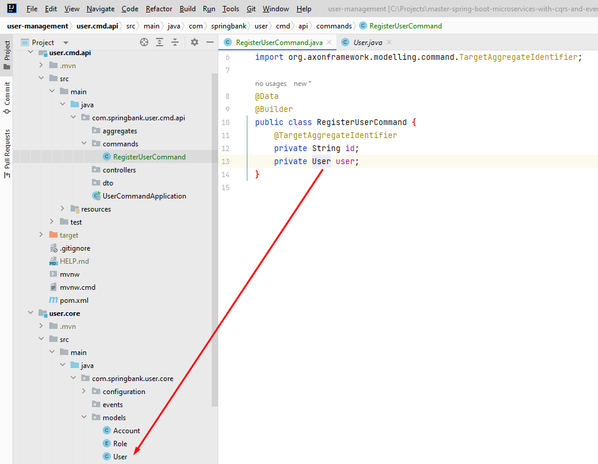

# Curso: Master Spring Boot Microservices with CQRS and Event Sourcing

## CQRS (Command Query Responsibility Segregation)

- Separação de responsabilidades entre leitura (Query) e escrita (Command) em uma aplicação.
- Exemplo: Ter uma camada de comandos para operações de escrita (e.g., salvar) e uma camada de consultas para operações de leitura (e.g., listar).

## Event Sourcing

- Utiliza um banco de eventos para armazenar o ciclo de vida de um objeto.
- Os eventos (create, update, delete) são armazenados e nunca apagados.
- Útil para ter um histórico completo das mudanças em um objeto.

## Microserviços

- Arquitetura que visa a independência e a falha isolada de serviços.
- Cada microserviço deve operar de forma independente, sem depender de outros serviços.
- Um microserviço deve considerar que "tudo falha o tempo todo" e deve falhar de forma independente.
- A comunicação entre microserviços ocorre através de um barramento de eventos (Event Bus).
- Os eventos são publicados por um microserviço e consumidos por outros, garantindo que as operações sejam realizadas de forma assíncrona e resiliente.
- O barramento de eventos permite que os eventos sejam persistidos mesmo se um consumidor falhar, garantindo a consistência quando o consumidor é reiniciado.

## Comandos, Queries e Eventos

- **Command**: Ordem de mudança no sistema, geralmente no formato de um verbo no imperativo (e.g., salvar, criar), pode conter dados sobre como executar a ordem.
- **Query**: Solicitação de um estado específico do objeto, operação de leitura.
- **Evento**: Objeto que descreve algo que já aconteceu, geralmente no formato de um verbo no passado (e.g., criado, atualizado).

## CQRS sem Event Sourcing

- Possibilidade de utilizar CQRS sem armazenamento de eventos, mantendo apenas o estado atual do sistema.

## Event Sourcing sem CQRS

- Utilização de Event Sourcing sem separação de responsabilidades entre leitura e escrita.

## API (Interface de Programação de Aplicação)
- Uma API é uma coleção de endpoints (pontos de extremidade) que permite a comunicação na web entre diferentes sistemas. Cada endpoint representa uma operação específica, que geralmente é realizada utilizando o protocolo HTTP.

-- **user.cmd.api**: API que não usa 

-- **user.query.api**: API que usa MongoDB

-- **user.core**: O projeto user.core não é uma API, pois não expõe endpoints restful, ele é uma biblioteca de classe interna, para apenas sistemas locais na rede springbankNet usar, por isso ele não possui a dependência Spring Web feita para usar controllers restful para expor endpoints.

## Biblioteca de Classes user.core
Quando o Axon Framework precisa interagir com o MongoDB (por exemplo, para armazenar eventos em um Event Store), ele usa a instância do MongoClient fornecida por esse bean. Essa configuração permite uma integração suave entre o Axon Framework e o MongoDB no contexto de um sistema que utiliza CQRS e Event Sourcing.

Ao Utilizar uma biblioteca de classe user.core na user.cmd.api eu posso reaproveitar o models > User da biblioteca em vez de ter que criar meus próprios modelos, uma vez que os modelos são os mesmos para a user.cmd.api e a user.query.api

## Domínio de Usuário 
Para a gestão do domínio de usuário, adotamos a abordagem CQRS, que se traduz na divisão do domínio em duas APIs distintas: **user.cmd.api** e **user.query.api**. Ao contrário do modelo tradicional, onde uma única interface lida tanto com operações de leitura quanto de escrita, optamos por caminhos separados para otimizar cada responsabilidade.

Essa separação possibilita a otimização de cada caminho de acordo com suas funções específicas, resultando em benefícios tangíveis como melhorias na escalabilidade e desempenho. Com o CQRS, podemos modelar os comandos e as consultas de maneira independente, ajustando cada um conforme necessário para atender aos requisitos particulares de cada operação.

Interessante notar que para a visão de aplicação do usuário, existe apenas um ponto focal dos recursos, a interface visual que ele está usando, mas na visão API interface de computador, quando o usuário solicita leitura usa user.query.api e quando ele solicita registrar algo, usa user.cmd.api controller updtate.

## Comandos do **user.cmd.api** e **Eventos do user.core** (Biblioteca de Classes)
- Todo comando resulta em um evento, os eventos ficam no user.core e são criados através do user.cmd.api pacote commands e pelos 3 comandos, Register, Update e Remove, portanto comandos do user.cmd.api e eventos do user.core estão fortemente relacionados. Vale notar que a user.query.api não produz nenhum comando, portanto não produz nenhum evento, ela apenas consome eventos e dados do banco de leitura.